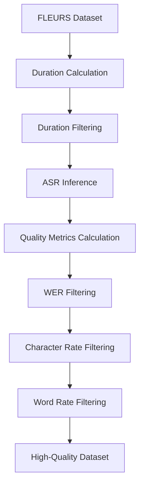

(audio-tutorials-advanced-quality)=

# Advanced Audio Quality Assessment

This tutorial demonstrates sophisticated audio quality assessment using multi-criteria filtering to curate high-quality speech datasets. You'll learn how to combine WER, duration, character rate, and word rate filtering for comprehensive data quality control.

```{tip}
This tutorial builds on the [Beginner Tutorial](beginner.md). Complete that first if you're new to NeMo Curator audio processing.
```

## Overview

While basic quality filtering uses a single threshold (like WER < 75%), real-world datasets often require more nuanced quality control. This tutorial shows how to apply multi-criteria quality gates in sequence to achieve superior data curation results.

## Quality Metrics Covered

### 1. **Duration Filtering**

- **Purpose**: Remove audio clips that are too short or too long
- **Typical Range**: 1-30 seconds for speech recognition training
- **Implementation**: `PreserveByValueStage` with duration bounds

### 2. **Word Error Rate (WER) Filtering**

- **Purpose**: Keep samples with accurate transcriptions
- **Typical Threshold**: ≤ 20% for high-quality datasets
- **Implementation**: `GetPairwiseWerStage` + `PreserveByValueStage`

### 3. **Character Rate Filtering**

- **Purpose**: Filter based on speaking speed (characters per second)
- **Typical Range**: 8-25 chars/second for natural speech
- **Implementation**: Automatic calculation in `GetPairwiseWerStage`

### 4. **Word Rate Filtering**

- **Purpose**: Filter based on speaking pace (words per second)
- **Typical Range**: 1.5-6.0 words/second for clear speech
- **Implementation**: Automatic calculation in `GetPairwiseWerStage`

## Pipeline Architecture

The advanced quality pipeline applies filters in this order:



## Running the Tutorial

### Basic Usage

```bash
cd tutorials/audio/

# Run with default quality thresholds
python advanced-quality.py \
    --data-dir /data/fleurs \
    --output-dir /output/high-quality-audio
```

### Custom Quality Thresholds

```bash
# Stricter quality control
python advanced-quality.py \
    --data-dir /data/fleurs \
    --output-dir /output/premium-quality \
    --max-wer 15.0 \
    --min-duration 2.0 \
    --max-duration 20.0 \
    --min-char-rate 10.0 \
    --max-char-rate 22.0 \
    --min-word-rate 2.0 \
    --max-word-rate 5.5
```

### Different ASR Model

```bash
# Use different ASR model for transcription
python advanced-quality.py \
    --data-dir /data/fleurs \
    --output-dir /output/conformer-quality \
    --model-name nvidia/stt_en_fastconformer_hybrid_large_pc \
    --max-wer 25.0
```

## Key Pipeline Stages

The tutorial demonstrates these NeMo Curator stages:

```python
# Duration calculation and filtering
GetAudioDurationStage().with_(resources=Resources(gpus=0))
PreserveByValueStage(field_name="duration", operator=">=", threshold=1.0)
PreserveByValueStage(field_name="duration", operator="<=", threshold=30.0)

# ASR inference with GPU acceleration
InferenceAsrNemoStage(
    model_name="nvidia/parakeet-tdt-0.6b-v2",
    filepath_key="audio_filepath",
    pred_text_key="pred_text"
).with_(resources=Resources(gpus=1), batch_size=32)

# Comprehensive quality metrics
GetPairwiseWerStage(
    pred_text_key="pred_text",
    ref_text_key="text"
).with_(resources=Resources(gpus=0))

# Multi-criteria filtering
PreserveByValueStage(field_name="wer", operator="<=", threshold=20.0)
PreserveByValueStage(field_name="char_rate", operator=">=", threshold=8.0)
PreserveByValueStage(field_name="char_rate", operator="<=", threshold=25.0)
PreserveByValueStage(field_name="word_rate", operator=">=", threshold=1.5)
PreserveByValueStage(field_name="word_rate", operator="<=", threshold=6.0)
```

## Expected Results

The tutorial produces progressively filtered datasets:

1. **Initial FLEURS samples**: ~1000 audio clips
2. **After duration filtering**: ~950 samples (remove short/long clips)
3. **After WER filtering**: ~800 samples (remove poor transcriptions)
4. **After character rate filtering**: ~750 samples (remove abnormal speech rates)
5. **After word rate filtering**: ~700 samples (final high-quality dataset)

**Output File**: `high_quality_audio.jsonl` with comprehensive quality metrics

## Quality Metrics Analysis

Each sample in the output includes these quality indicators:

```json
{
  "audio_filepath": "/path/to/audio.wav",
  "text": "Ground truth transcription",
  "pred_text": "ASR prediction",
  "duration": 8.45,
  "wer": 12.5,
  "cer": 8.2,
  "char_rate": 15.8,
  "word_rate": 3.2
}
```

## Customization Options

### Adjust Quality Thresholds

Adjust thresholds based on your use case:

```python
# For training data (stricter)
max_wer = 15.0
min_char_rate = 10.0
max_char_rate = 22.0

# For evaluation data (more permissive)  
max_wer = 30.0
min_char_rate = 6.0
max_char_rate = 28.0
```

### Add Custom Quality Metrics

Extend the pipeline with extra filtering:

```python
# Add custom filtering stage after quality metrics
pipeline.add_stage(
    PreserveByValueStage(
        field_name="cer",  # Character Error Rate
        operator="<=", 
        threshold=10.0
    ).with_(name="filter_cer")
)
```

### Language-Specific Models

Use appropriate ASR models for different languages:

```python
language_models = {
    "en_us": "nvidia/stt_en_fastconformer_hybrid_large_pc",
    "es_es": "nvidia/stt_es_fastconformer_hybrid_large_pc", 
    "de_de": "nvidia/stt_de_fastconformer_hybrid_large_pc",
}
```

## Performance Considerations

### Resource Configuration

```python
# CPU-intensive stages
GetAudioDurationStage().with_(resources=Resources(gpus=0))
GetPairwiseWerStage().with_(resources=Resources(gpus=0))

# GPU-accelerated stages
InferenceAsrNemoStage().with_(
    resources=Resources(gpus=1),
    batch_size=32  # Adjust based on GPU memory
)
```

### Batch Size Tuning

- **Small GPU (8GB)**: `batch_size=16`
- **Medium GPU (16GB)**: `batch_size=32`
- **Large GPU (24GB+)**: `batch_size=64`

## Next Steps

After completing this tutorial, you can:

1. **Apply to Custom Datasets**: Replace `CreateInitialManifestFleursStage` with `JsonlReader` for your own data
2. **Experiment with Thresholds**: Find optimal quality settings for your specific use case
3. **Add Domain-Specific Filtering**: Include custom quality metrics relevant to your domain
4. **Scale to Large Datasets**: Use distributed processing for production workloads

## Related Topics

- **[Beginner Tutorial](beginner.md)** - Start here if you're new to audio processing
- **[Quality Assessment](../process-data/quality-assessment/index.md)** - Detailed quality metrics documentation  
- **[ASR Inference](../process-data/asr-inference/index.md)** - ASR model configuration options
- **[Custom Manifests](../load-data/custom-manifests.md)** - Working with your own audio datasets
